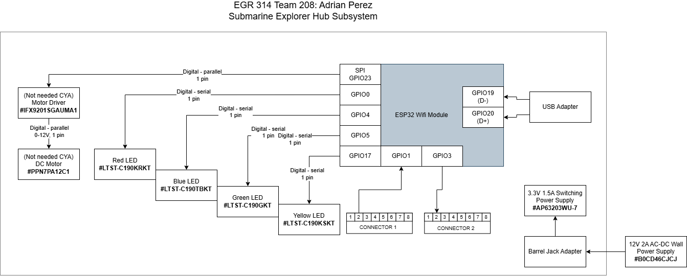

## Overview
In this module, it is very simple: the ESP32 is connected to 3.3V, the motor driver, and the motor are there in case the system isn't complex enough. This module is also connected to two other modules, one being through UART and the other wirelessly.

## Adrian's Block Diagram 

You can get it as a [PDF](Perez_Individual_Block_Diagram_FinalV.pdf) or a [Draw.io file.](Perez_Individual_Block_Diagram_FinalV.drawio)

## Development Process
My team was on the same page about the kind of exploratory device we wanted to do, and we allocated it to put ourselves in the areas we wanted to learn or improve. In 304, I was just a simple sensor subsystem, and I wanted to branch out into signal management and explore new territory, so I decided to be the hub of our project. Thinking about how I need to be the hub, I need to map out all the messages and signals my teammates will send. Since we have 3 sensors, a motor controller, and an HMI, I need to be able to communicate with all of them and wirelessly connect to the HMI. This would then force me to immensely grow my coding skills to manage all the message typing and reading from everyone.

## Requirements
* MQTT and  WIFI
* Utilizes ESP32
* UART Upstream and downstream connection
* Switching regulator
* Surface mount components
* USB programming
