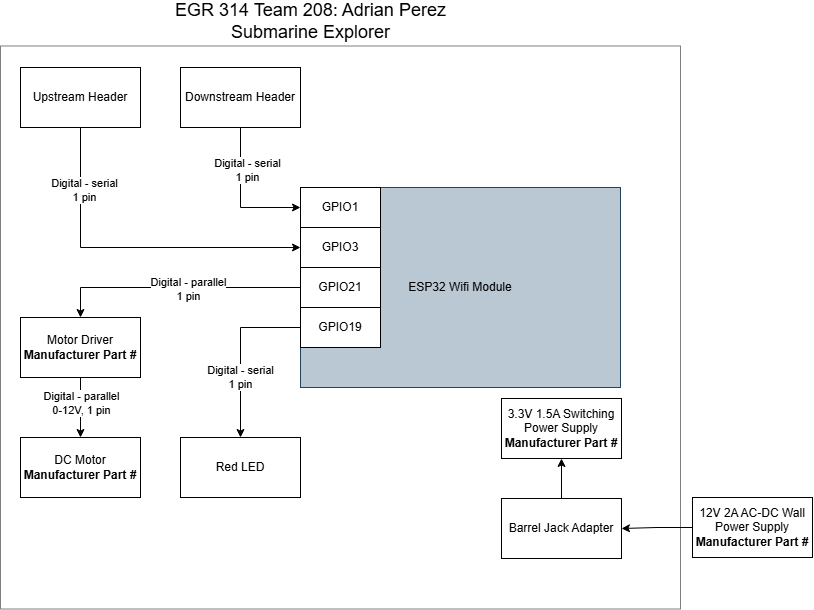

## Overview
In this Subsystem, a motor driver requires two different power levels. 3.3V for the ESP32 and 12V for the motor. The subsystem is also connected to other subsystems via a UART that controls the motor's pulse and direction.

## Adrian's Block Diagram 

You can get it as a [PDF](Perez_EGR314_BlockDiagramV1.pdf) or a [Draw.io file.](Perez_EGR314_BlockDiagramV1.drawio)
