## Module's Selected Major Components

The following sections are the selected major components necessary for my subsystem of the project. This is the Main Hub subsystem that will communicate with all the other subsystems in this project. 

### Power Management

The [MIC5365-3.3YC5-TR](https://www.digikey.com/en/products/detail/microchip-technology/MIC5365-3-3YC5-TR/1868094) is the optimal choice for this design. This regulator is a Low-Dropout (LDO) type. It is chosen because our system uses very little power for the logic circuits. Using a switching regulator like the TI or Diodes parts would be overkill. Those parts require an inductor and extra resistors, which take up too much board space and add cost.

The [AP63203WU-7](https://www.digikey.com/en/products/detail/diodes-incorporated/AP63203WU-7/9858426) offers the best power density for our project. It supports up to 2A, giving us plenty of power to run the motor driver logic and the microcontroller. Unlike the older AP1509, which runs at a low frequency and requires a bulky inductor, the AP63203 runs at 1.1MHz. This high frequency allows us to use much smaller inductors and capacitors, saving valuable space on the PCB.

### Actuator

The PAN14EE12AA1 is the optimal choice for this design. The PAN14EE12AA1 provides the best balance of speed and cost-efficiency. It reaches 12,850 RPM, which is significantly higher than the SE18K1 model's 4,050 RPM. This high speed is vital to meeting the project's performance requirements without complex gearing. 

The IFX9201SGAUMA1 is the optimal choice for this design. This driver is the only option that provides enough power for the high-speed motors in our design. While the other drivers are cheaper, they only support 1A to 1.3A. Our motors require a driver that can handle higher startup and stall currents. The IFX9201 handles up to 6A, providing a large safety margin to prevent chip failure under heavy loads.

---------------

**Power Management**

| **Component**                                                                                                                                                                                      | **Pros**                                                                                                                                    | **Cons**                                                                                            |
| ------------------------------------------------------------------------------------------------------------------------------------------------------------------------------------------------- | ------------------------------------------------------------------------------------------------------------------------------------------- | --------------------------------------------------------------------------------------------------- |
| 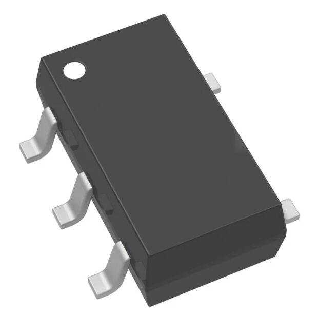 Option 1.  MIC5365-3.3YC5-TR $0.12/each [link to product](https://www.digikey.com/en/products/detail/microchip-technology/MIC5365-3-3YC5-TR/1868094)                 | \* Very low electrical noise.  \* Only needs two small capacitors.  \* Extremely small SC-70 package.                                               | \* Limited to 150mA current. \* Wastes energy as heat. \* Input must stay near 3.3V.|
| 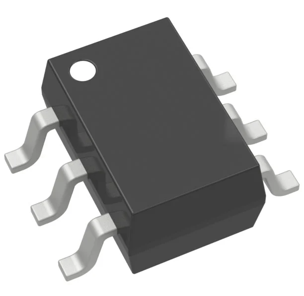 \* Option 2.  \* AP1013CEN  \* $0.24/each  \* [Link to product](https://www.digikey.com/en/products/detail/texas-instruments/TLV62569PDDCR/8106072) | \* High 2A output current. \* Great battery efficiency (95%).  \* Runs cool under heavy loads. | * Needs an external inductor.  \* More complex circuit layout. \* Poor thermal dissipation. 
| 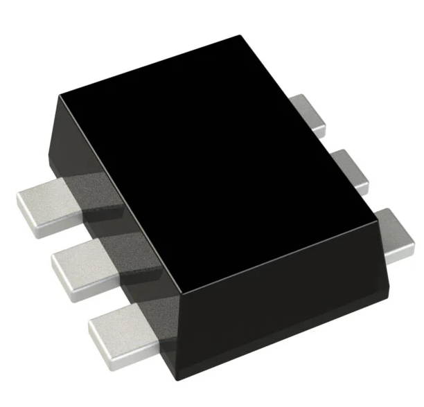 \* Option 3.  \* AP61102Z6-7  \* $0.21/each  \* [Link to product](https://www.digikey.com/en/products/detail/diodes-incorporated/AP61102Z6-7/12702554) | \* Good 1A current rating. \* Constant frequency operation.  \* Wide input voltage range. | * Lower efficiency than the TI part.  \* Needs extra board space.  \* More parts to buy and solder.

| **Component**                                                                                                                                                                                      | **Pros**                                                                                                                                    | **Cons**                                                                                            |
| ------------------------------------------------------------------------------------------------------------------------------------------------------------------------------------------------- | ------------------------------------------------------------------------------------------------------------------------------------------- | --------------------------------------------------------------------------------------------------- |
| 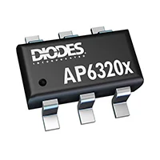 Option 1.  AP63203WU-7 $0.80/each [link to product](https://www.digikey.com/en/products/detail/diodes-incorporated/AP63203WU-7/9858426)                 | \* High 2A output current.  \* Tiny TSOT26 package.  \* High 1.1MHz frequency. | \* Requires careful PCB layout. \* Small pins can be hard to solder.|
| 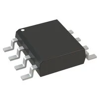 \* Option 2.  \* AP1509-33SG-13  \* $1.41/each  \* [Link to product](https://www.digikey.com/en/products/detail/diodes-incorporated/AP1509-33SG-13/1301327) | \* Larger SO-8 package is easy to use. \* Simple 150kHz operation.  \* Trusted, older technology. | * Very low efficiency (heat risk).  \* Needs a very large inductor. \* Limited to 1.5A output. 
| 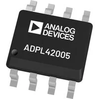 \* Option 3.  \* ADP2302ARDZ-3.3-R7  \* $3.94/each  \* [Link to product](https://www.digikey.com/en/products/detail/analog-devices-inc/ADP2302ARDZ-3-3-R7/2606526) | \* High 2A current rating. \* Precision enable control.  \* Built-in soft start feature. | * Most expensive unit.  \* Largest physical footprint.  \* Needs many external parts.

**Motor Driver**

| **Component**                                                                                                                                                                                      | **Pros**                                                                                                                                    | **Cons**                                                                                            |
| ------------------------------------------------------------------------------------------------------------------------------------------------------------------------------------------------- | ------------------------------------------------------------------------------------------------------------------------------------------- | --------------------------------------------------------------------------------------------------- |
| 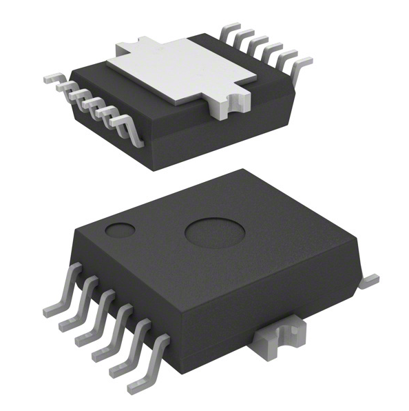 Option 1.  IFX9201SGAUMA1 $3.55/each [link to product](https://www.digikey.com/en/products/detail/infineon-technologies/IFX9201SGAUMA1/5415542)                 | \* Highest current rating. (6A) \* Advanced SPI interface for data.  \* Very robust protection features.                                               | \* Most expensive unit ($3.55). \* Larger physical footprint. \* Requires complex programming.|
| 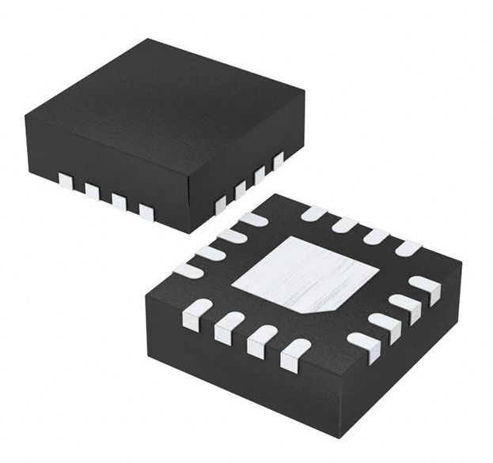 \* Option 2.  \* AP1013CEN  \* $0.88/each  \* [Link to product](https://www.digikey.com/en/products/detail/asahi-kasei-microdevices-akm/AP1013CEN/5182224) | \* Extremely low cost ($0.88). \* Tiny 3x3mm QFN package.  \* Simple logic interface. | * Low 1.3A current limit.  \* Not for new designs (obsolete) \* Poor thermal dissipation. 
| 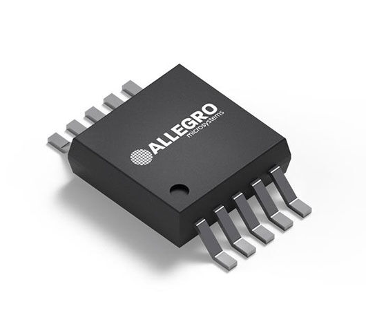 \* Option 3.  \* A3909GLYTR-T  \* $1.43/each  \* [Link to product](https://www.digikey.com/en/products/detail/allegro-microsystems/A3909GLYTR-T/3979656) | \* Includes four half-bridges. \* Can drive two motors at once.  \* Small 10-MSOP package. | * Lowest current (1A per channel).  \* High 1.6 Ohm resistance.  \* Long 24-week lead time.

**Actuator**

| **Component**                                                                                                                                                                                      | **Pros**                                                                                                                                    | **Cons**                                                                                            |
| ------------------------------------------------------------------------------------------------------------------------------------------------------------------------------------------------- | ------------------------------------------------------------------------------------------------------------------------------------------- | --------------------------------------------------------------------------------------------------- |
| 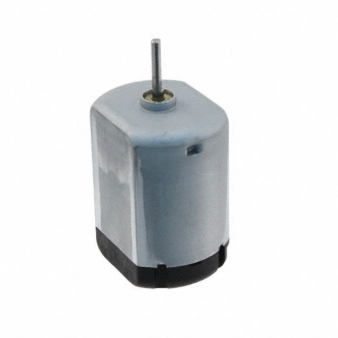 Option 1.  PAN14EE12AA1 $5.22/each [link to product](https://www.digikey.com/en/products/detail/nmb-technologies-corporation/PAN14EE12AA1/2417070)                 | \* Highest speed at 12,850 RPM. \* Most affordable option ($5.22). \* Uses a simple connector style.                                               | \* Larger diameter than others. \* Slightly heavier at 39 grams.|
| 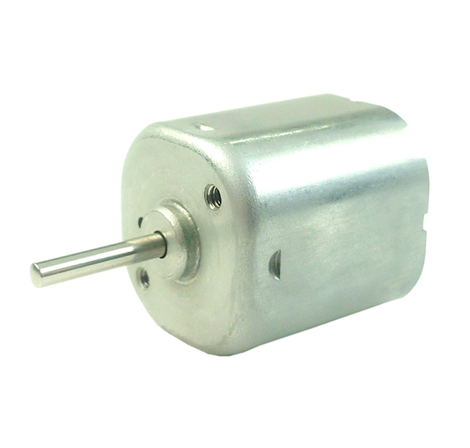 \* Option 2.  \* SE18K1ETYC  \* $9.29/each  \* [Link to product](https://www.digikey.com/en/products/detail/nmb-technologies-corporation/SE18K1ETYC/6021449) | \* Square shape helps with mounting. \* Lightweight (31.75 grams).  \* Middle price point ($9.29). | * Lowest speed at only 4,050 RPM.  \* Larger shaft diameter (2mm). 
| 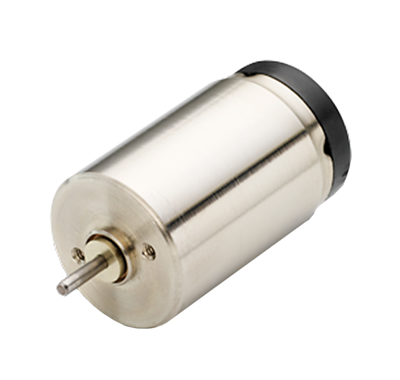 \* Option 3.  \* 17N78210E.1  \* $141.02/each  \* [Link to product](https://www.digikey.com/en/products/detail/portescap/17N78210E-1/5032382) | \* Very small 17mm diameter. \* Lightest weight (27.22 grams).  \* Wide temperature range. | * Extremely expensive ($141.02).  \* Requires soldering to tabs.  \* Longest lead time (21 weeks).

## Finalized Selections
This is the same as the top section of this page, just in table format.
| Component | Link |
|-----------|------|
| MIC5365-3.3YC5-TR | [Link](https://www.digikey.com/en/products/detail/microchip-technology/MIC5365-3-3YC5-TR/1868094) |
| AP63203WU-7 | [Link](https://www.digikey.com/en/products/detail/diodes-incorporated/AP63203WU-7/9858426) |
| PAN14EE12AA1 | [Link](https://www.digikey.com/en/products/detail/nmb-technologies-corporation/PAN14EE12AA1/2417070) |
| IFX9201SGAUMA1 | [Link](https://www.digikey.com/en/products/detail/infineon-technologies/IFX9201SGAUMA1/5415542) |
