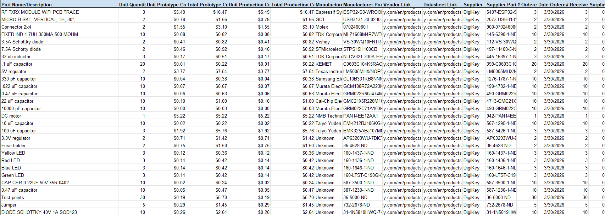

## Overview
The purchasing budget for this project is $60, excluding taxes, tariffs, and PCB manufacturing costs. We can share the full list of parts without going over the budget. This list does not include taxes, fees, or the cost to make the circuit board. It helps people build the project themselves with a clear view of the costs.

## Bill of Materials 
{style width: "2000"}
**Figure 1:** Bill of Materials as a screenshot.

## Resouces

The Bill of Materials is available as a PDF download [*here*](Perez_BOM.pdf) and the Excel file is [*here*](Perez_BOM.xlsx).
