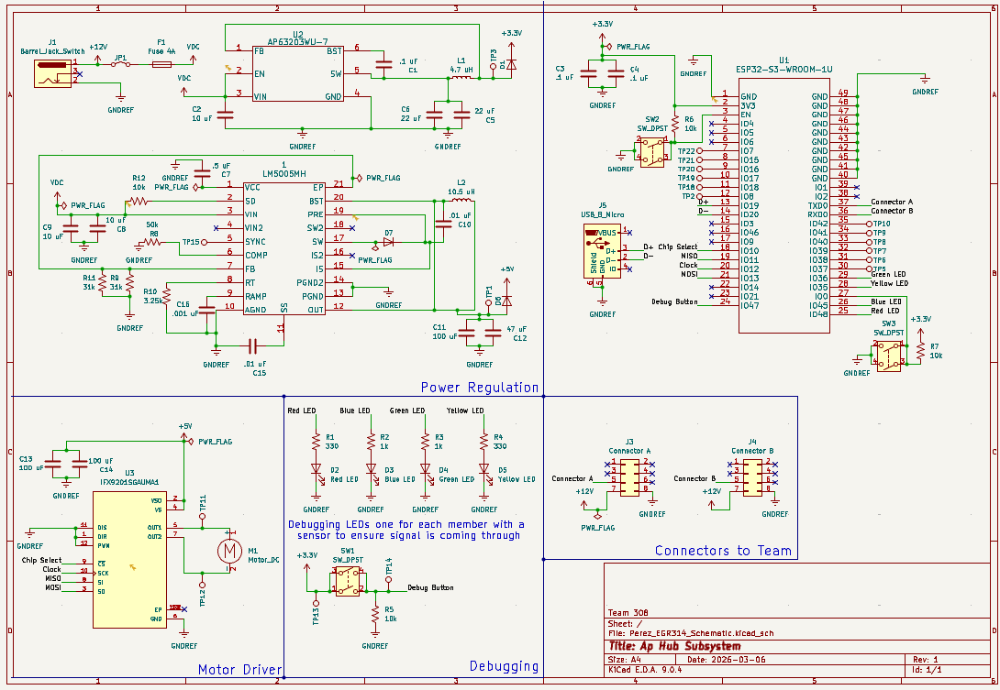

## Overview

This schematic is designed to support the power shared from the team and be the central hub system.

{style width:"350" height:"300;"}
**Figure 1:** Showing schematic.

## Resouces

The schematic is available as a PDF download [*here*](Perez_EGR314_SchematicV2.pdf), and the project Zip folder [*here*](Perez_EGR314_SubsystemV2.zip).
