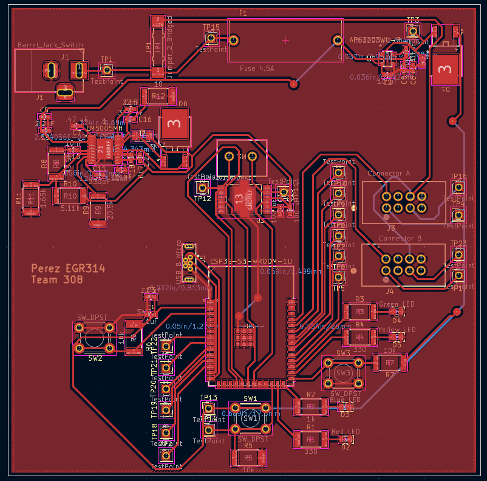
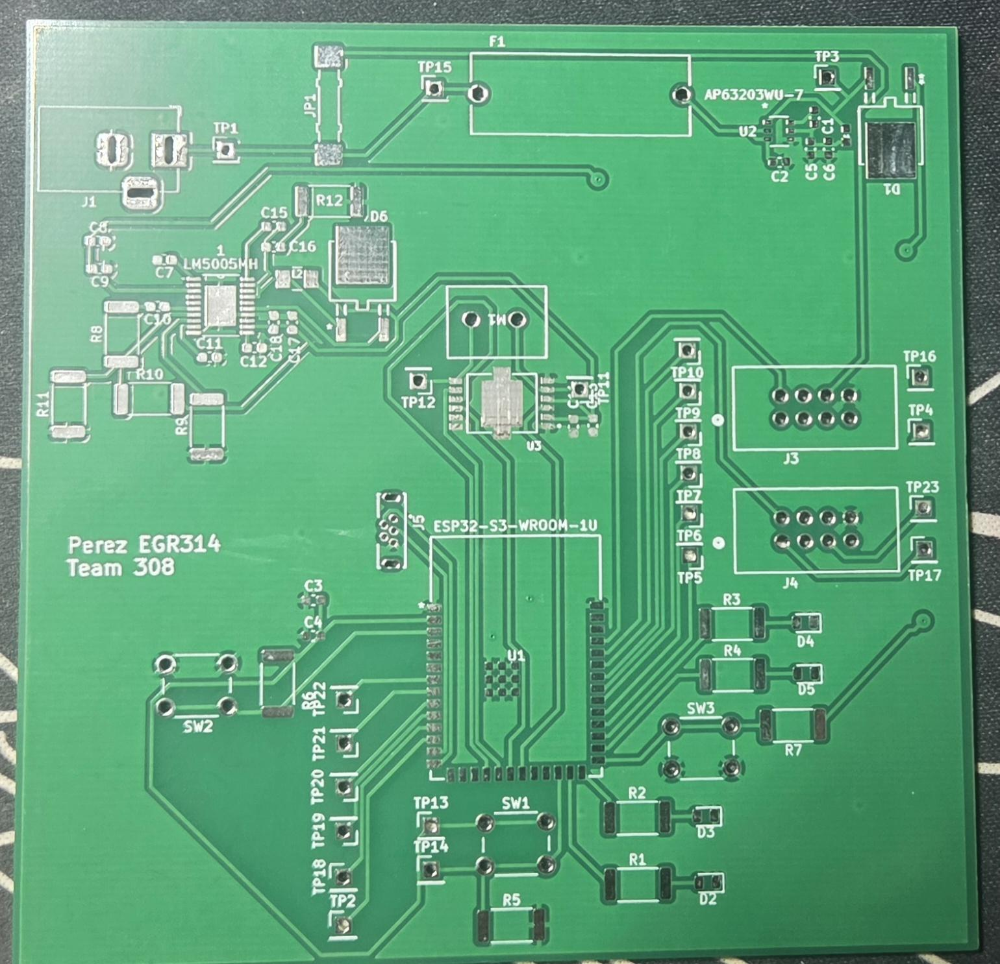
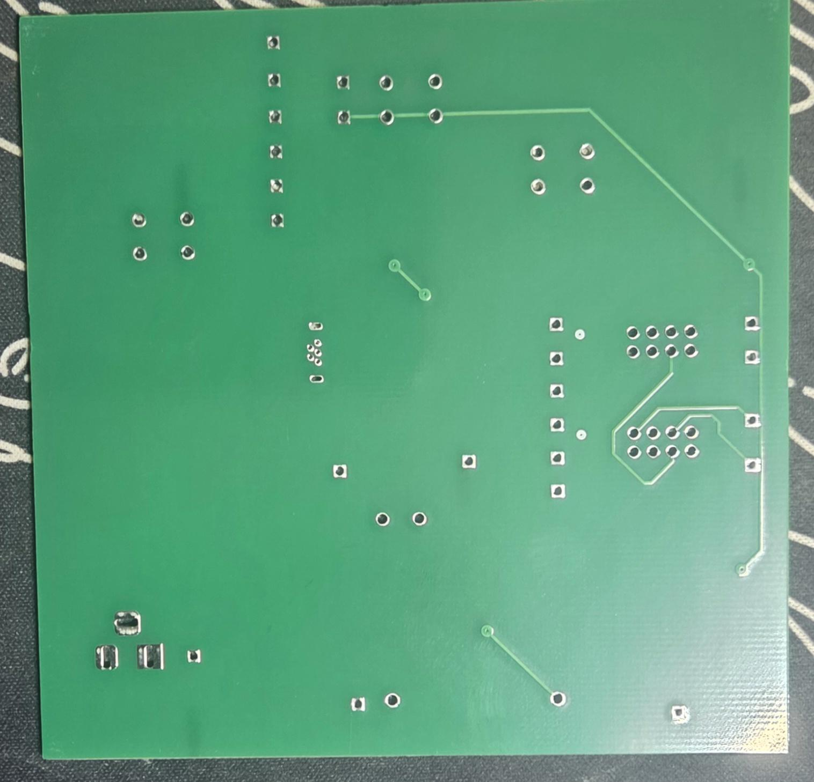
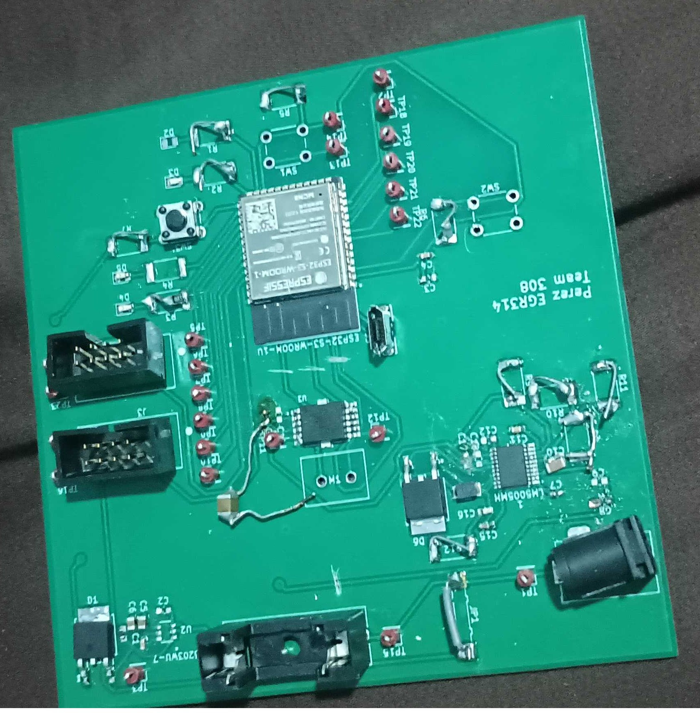
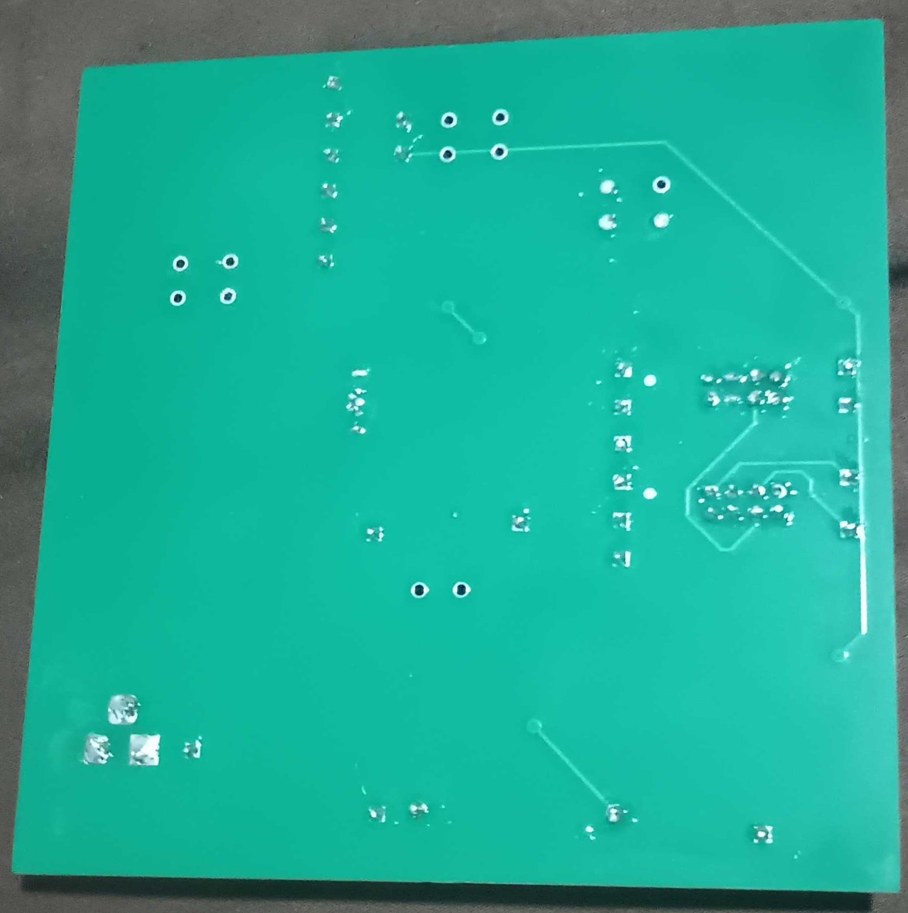

## Overview

This PCB is designed to support power from the team and serve as the central hub.

{style width:"350" height:"300;"}
**Figure 1:** Showing PCB.

{style width:"350" height:"300;"}
**Figure 2:** Showing front of PCB unpopulated.

{style width:"350" height:"300;"}
**Figure 3:** Showing back of PCB unpopulated.

{style width:"350" height:"300;"}
**Figure 4:** Showing front of PCB populated.

{style width:"350" height:"300;"}
**Figure 5:** Showing back of PCB populated.

## Resouces

The PCB is available as a Gerber zip file download [*here*](Perez_GerberV2.zip).
