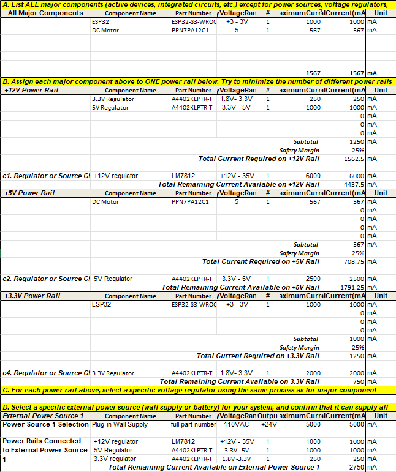

## Overview
I examined the main components of my subsystem and determined their maximum current. I added a safety margin and checked if the supply could handle the load. If the supply fails, I will go back and choose better components.

## Conclusions

Based on the prepared Power Budget, we will need to recheck our regulator choices or obtain more details on how the parts will operate. The current plan shows the LM7812 regulator handling the input, but the load calculation seems low compared to the totals for the 5V and 3.3V rails. We might need a larger heat sink or a different part to prevent it from getting too hot under full load. This model assumes the ESP32 will pull a full 1A, and the DC motor will pull its peak current at the same time. While it is rare for both to reach these peaks at once, we must plan for the worst-case scenario to keep the system safe. We have a good 25% safety margin added to our totals, which gives us some breathing room. The 5000 mA wall supply provides plenty of power, leaving over 2700 mA free, so we have enough energy to run the whole project safely.

## Resouces

The power budget is available as a PDF [*here*](Perez_Power_Budget.pdf) and an Excel Sheet [*here*](Perez_Power_Budget.xlsx).
